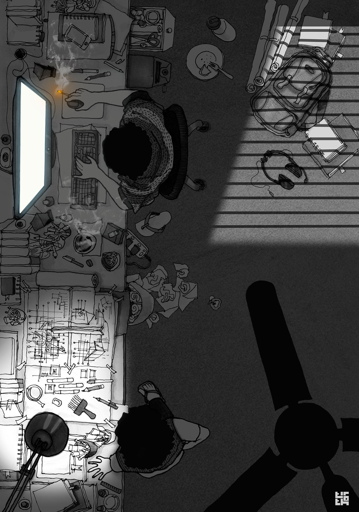

 &nbsp;
 &nbsp;

- 🐛 Working on different aspects of Information Security .
- 🌱 I’m passionate about Appsec, Iot and [Web3](https://ethereum.org/en/web3/).
- 📝 I’m aiming to write **one article per week** starting from February 2024.
- 🏆 I'm striving to increase my [GitHub stats rating](#🏆-my-stats) by contributing to [open source](https://opensource.com/resources/what-open-source).
- ⚡ Fun fact: I read comics and watch anime!

## 💡 A Quote:

## 📕 Latest Blog posts
<!-- BLOG-POST-LIST:START -->
- [Hello World](https://shahriffy.github.io/)
<!-- BLOG-POST-LIST:END -->

## 🏆 My Stats:

    &nbsp;&nbsp;
    &nbsp;&nbsp;

## 🎮 When I'm AFK:

 &nbsp;
 &nbsp;

