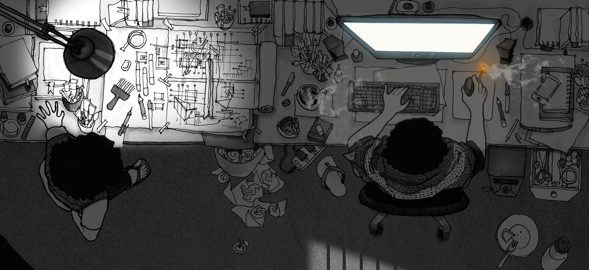

 &nbsp;
 &nbsp;

- 🐛 Working on different aspects of Information Security .
- 🌱 I’m passionate about Appsec, Iot and [Web3](https://ethereum.org/en/web3/).
- 📝 I’m aiming to write **one article per week** starting from February 2024.
- ⚡ Fun fact: I read comics and watch anime!

## 💡 A Quote:

## 📕 Latest Blog posts
<!-- BLOG-POST-LIST:START -->
- [Cryptography101 : Introduction to Cryptography](https://shahriffy.medium.com/cryptography101-introduction-to-cryptography-1aefb978b802)
- [TempImage -Hacker101](https://shahriffy.medium.com/tempimage-hacker101-8f61febb6e0d)
- [HackTheBox: Cryptohorrific Challenge](https://shahriffy.medium.com/hackthebox-cryptohorrific-challenge-4f4cb5263565)
<!-- BLOG-POST-LIST:END -->

## 🏆 My Stats:

<!-- 

 -->

 
   <!-- ! .....      

